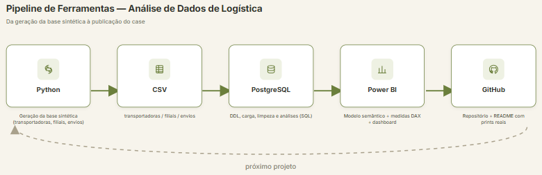
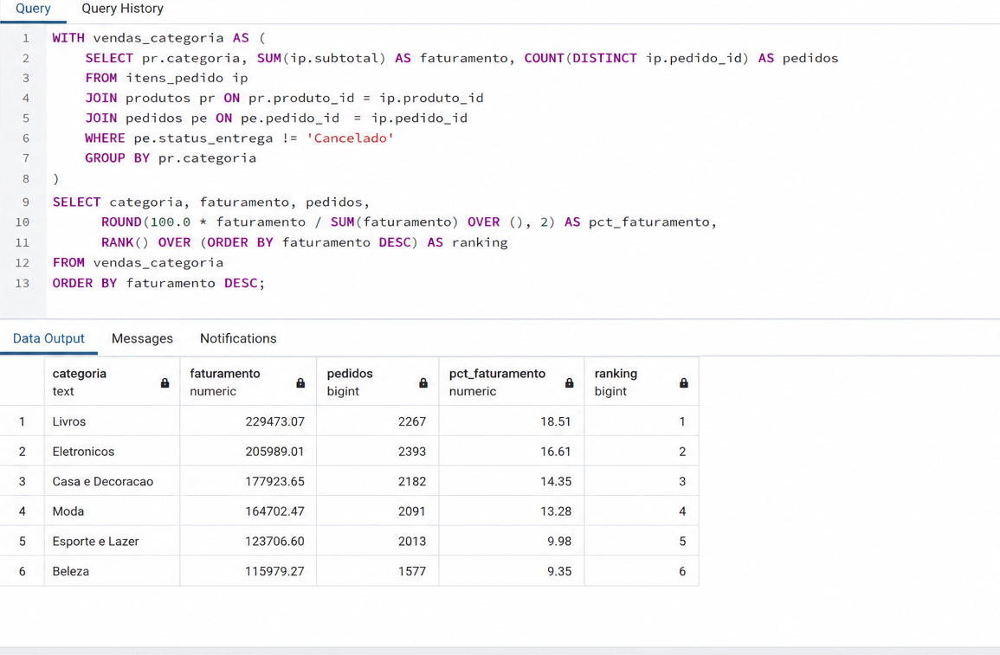

# Análise de Dados na Prática: Comportamento de Vendas em um E-commerce

Projeto de portfólio de Vitor Franca, engenheiro civil migrando para análise de dados. Dashboard em Power BI (arquivo `EcommerceVendas.pbip` na raiz do repositório).

## A base

A base é sintética, gerada em Python com distribuição realista (Pareto para volume de compra por cliente, lognormal para preço de produto), mas tratada com o mesmo rigor de uma base real: 1.800 clientes, 120 produtos em 8 categorias, 9.500 pedidos e 18.648 itens de pedido. O schema fica isolado em `ecommerce_vendas` (não em `public`), com PKs, FKs e CHECK constraints nas colunas categóricas, e todos os números abaixo saíram de execução real das queries em `02_sql/04_analises.sql` contra essa base, num PostgreSQL local.

Descontando os 559 pedidos cancelados (5,88% do total), o e-commerce fatura R$ 1.239.922,77 em 8.941 pedidos válidos, com ticket médio de R$ 138,68 e ticket mediano de R$ 98,05 — a diferença entre os dois já entrega um insight: a média está puxada por um grupo menor de pedidos de valor alto, então olhar só o ticket médio esconde o comportamento típico do cliente. 15,48% dos pedidos chegam com atraso, o que é alto o suficiente pra virar prioridade de investigação num cenário real.

Livros lidera o faturamento por categoria com R$ 229.473,07 (18,51% do total), seguido de perto por Eletrônicos com R$ 205.989,01 (16,61%); as duas categorias sozinhas respondem por mais de um terço do faturamento. Cartão de Crédito é a forma de pagamento mais usada (39,76% dos pedidos, R$ 478.594,17 em faturamento), com Pix logo atrás (35,21%, R$ 449.896,45) — juntos cobrem quase 75% do volume. A Região Sudeste concentra o maior volume absoluto (3.695 pedidos, R$ 512.998,15), mas o Centro-Oeste tem o maior ticket médio entre todas as regiões (R$ 148,44), o que sugere um perfil de compra diferente e vale investigar à parte. Entre os clientes que fizeram pelo menos um pedido, 85,15% voltaram a comprar mais de uma vez — uma taxa de recompra alta que indica uma base de clientes fiel, mais do que um fluxo constante de compradores novos.

## Como o projeto foi montado

**Extração e modelagem dos dados.** A base foi gerada em Python (`gerar_base.py`), simulando clientes, catálogo de produtos, pedidos e itens de pedido com distribuições estatísticas que imitam padrões reais de e-commerce (poucos clientes concentrando grande parte das compras, descontos aplicados de forma não uniforme, atraso de entrega como exceção e não regra).

**Tratamento e análise em SQL.** As tabelas foram criadas com schema próprio e constraints (`01_criar_tabelas.sql`), os CSVs carregados via `\copy` com delimitador `;` (`02_carregar_dados.sql`), e a limpeza cobriu checagem de nulos, outliers em `valor_total` via `PERCENTILE_CONT` e criação de colunas derivadas como `ano_mes` (`03_limpeza.sql`). As análises finais (`04_analises.sql`) usam CTE, window functions (`RANK()`, `SUM() OVER()`), `PERCENTILE_CONT` e `FILTER` para chegar nos números de faturamento, cancelamento, recompra e ranking de clientes.

**Dashboard em Power BI.** O modelo semântico (`EcommerceVendas.SemanticModel`) conecta as quatro tabelas por relacionamento de chave estrangeira e centraliza as medidas DAX (Faturamento Total, Ticket Médio, % Cancelado, % Atrasado, Clientes com Recompra %, entre outras). O relatório (`EcommerceVendas.Report`) traz cards de KPI, faturamento por categoria, distribuição por forma de pagamento, evolução mensal de faturamento e ticket médio por região.

## Estrutura do repositório

`02_sql/` reúne os quatro scripts SQL (criação, carga, limpeza, análises). `03_dados/` tem os CSVs sintéticos com delimitador `;`. `06_prints/` guarda o fluxograma do pipeline e o print da consulta. `EcommerceVendas.pbip`, `EcommerceVendas.SemanticModel` e `EcommerceVendas.Report` compõem o projeto Power BI.

## O que o dashboard mostra

Faturamento total, ticket médio e mediano, taxa de cancelamento e de atraso na entrega ficam nos cards do topo. Um gráfico de barras mostra o volume de itens vendidos por categoria, um donut mostra a participação de cada forma de pagamento no faturamento, uma linha temporal mostra a evolução mensal do faturamento entre agosto de 2024 e julho de 2026, e um último gráfico compara o ticket médio entre as cinco regiões do país.

## Autor

Vitor Franca, engenheiro civil em transição estruturada para análise de dados, com projetos práticos em SQL, Python e Power BI documentados neste GitHub.
